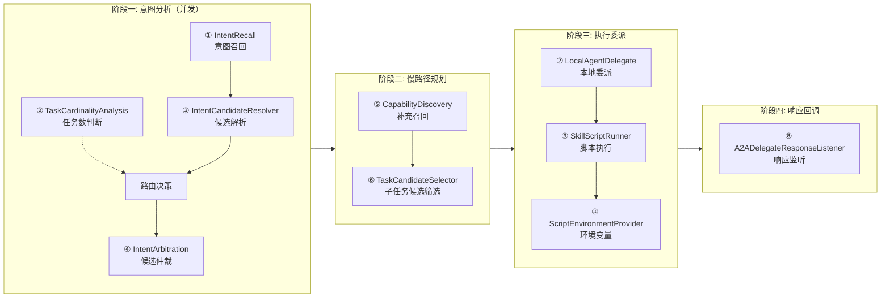

# 意图中控完整流程图 — SPI 扩展点标注

> 基于 [意图中控流程与SPI扩展分析.md](file:///d:/work/code-proj/openjiuwen-fin/moa/意图中控流程与SPI扩展分析.md) 绘制
> 底座：`moa/phoenix` · 业务扩展：`moa/demo`

---

## 一、完整流程图（Mermaid）

```mermaid
flowchart TD
    %% ===== 入口 =====
    UserReq["👤 用户请求<br/>HTTP POST"]:::userNode
    Adapter["MoaCustomRestAdapter<br/>.toA2ARequest()<br/>HTTP 解包为 A2A 消息"]:::baseNode
    DeepAgent["DeepAgent.invoke()<br/>L1 智能体入口"]:::baseNode

    UserReq --> Adapter --> DeepAgent

    %% ===== Rail 链 beforeInvoke =====
    DeepAgent --> RailBefore["Rail 链 beforeInvoke<br/>按 priority 降序执行"]:::railNode

    %% ===== 意图路由分流 =====
    RailBefore --> RouterEntry["IntentRoutingRail<br/>priority=2000<br/>请求路由入口"]:::railNode

    RouterEntry --> CheckContinue{"继续计划?<br/>服务带出查询?"}
    CheckContinue -- "是" --> ContinuePlan["恢复挂起计划 /<br/>ServiceCarryout 推荐"]:::baseNode
    CheckContinue -- "否" --> RouteCall["IntentRouter.route()<br/>核心路由器"]:::baseNode

    %% ===== 显式 intent 快捷路径 =====
    RouteCall --> CheckExplicit{"显式 intent<br/>唯一命中?"}
    CheckExplicit -- "是" --> FastPath["快路径 FAST<br/>直接委派"]:::fastPath

    %% ===== 并发分析 =====
    CheckExplicit -- "否" --> Concurrent["并发执行<br/>独立线程池"]:::baseNode

    Concurrent --> Recall["① IntentRecall.recall()<br/>意图召回<br/><b>SPI 扩展点 ①</b><br/>━━━━━━━━━━━━━━━━━━<br/>底座: PackIntentRecall<br/>(YAML 关键词召回)<br/>demo: WorkflowIntentRecall<br/>(HTTP 外部意图工作流)<br/>━━━━━━━━━━━━━━━━━━<br/>开关: external-intent-enabled"]:::spiNode

    Concurrent --> Cardinality["② TaskCardinalityAnalysis.classify()<br/>任务数判断<br/><b>SPI 扩展点 ②</b><br/>━━━━━━━━━━━━━━━━━━<br/>底座: ModelTaskCardinalityAnalysis<br/>(LLM 分类)<br/>demo: HttpTaskCardinalityAnalysis<br/>(HTTP 外部服务)<br/>━━━━━━━━━━━━━━━━━━<br/>返回: SINGLE / MULTIPLE / UNKNOWN<br/>开关: external-cardinality-enabled"]:::spiNode

    %% ===== 候选解析 =====
    Recall --> Resolver["③ IntentCandidateResolver.resolve()<br/>召回意图 → 候选卡解析<br/><b>SPI 扩展点 ③</b><br/>━━━━━━━━━━━━━━━━━━<br/>底座: DefaultIntentCandidateResolver<br/>(精确匹配+动态 HIGH 候选)<br/>demo: FinanceSkillCandidateResolver<br/>(理财意图 → 组合 Skill 卡)<br/>━━━━━━━━━━━━━━━━━━<br/>开关: finance-skill-enabled<br/>+ skill-agent.enabled"]:::spiNode

    Cardinality --> Decision["IntentRouter.decide()<br/>路由决策"]:::baseNode
    Resolver --> Decision

    %% ===== 路由决策分支 =====
    Decision --> DecideBranch{"任务数 + 候选数<br/>判断分流"}

    %% --- 快路径: SINGLE + 1候选 ---
    DecideBranch -- "SINGLE + 1候选" --> FastDirect["快路径 FAST<br/>单任务直接委派"]:::fastPath

    %% --- 快路径选择: SINGLE + 多候选 ---
    DecideBranch -- "SINGLE + 多候选" --> Arbitration["④ IntentArbitration.select()<br/>候选仲裁<br/><b>SPI 扩展点 ④</b><br/>━━━━━━━━━━━━━━━━━━<br/>底座: ModelIntentArbitration<br/>(LLM 筛选 1~3 项)<br/>demo: PassthroughIntentArbitration<br/>(透传全部候选)<br/>━━━━━━━━━━━━━━━━━━<br/>返回: 1-based 序号列表<br/>开关: arbitration-passthrough-enabled"]:::spiNode

    Arbitration --> ArbResult{"仲裁结果"}

    ArbResult -- "1 项" --> FastDirect
    ArbResult -- "2~3 项" --> FastSelect["快路径选择 FAST_SELECT<br/>中断等待用户选择"]:::fastPath
    ArbResult -- "无匹配/失败" --> SlowEntry

    FastSelect --> UserSelect["👤 用户选择候选"]:::userNode
    UserSelect --> FastSelectResume["CandidateSelection.resolve()<br/>CandidateChoices.remember()"]:::baseNode
    FastSelectResume --> FastDirect

    %% --- 慢路径 ---
    DecideBranch -- "MULTIPLE / UNKNOWN" --> SlowEntry["慢路径 SLOW<br/>交给模型规划"]:::slowPath

    %% ===== 快路径执行 =====
    FastDirect --> StartFast["planning.startFast()<br/>创建单 todo, phase=READY"]:::fastPath
    StartFast --> Dispatch1["ExecutionEngine.dispatch()<br/>构造 A2A 委派中断"]:::baseNode
    Dispatch1 --> WaitCallback1["⏳ 等待 L2 回调"]:::baseNode

    WaitCallback1 --> BeforeToolFast["IntentRoutingRail.beforeToolCall()<br/>处理快路径回调"]:::railNode
    BeforeToolFast --> FinishFast["planning.finishFast()<br/>记录结果"]:::fastPath
    FinishFast --> Terminal["终答返回用户"]:::terminal

    %% ===== 慢路径: RequestCapabilityRail =====
    SlowEntry --> CapRail["RequestCapabilityRail<br/>priority=-10000<br/>beforeModelCall"]:::railNode
    CapRail --> Inject["注入候选数据为 UserMessage<br/>过滤工具白名单为阶段工具"]:::baseNode
    Inject --> ModelPlan["模型调用 stage_plan"]:::modelNode

    %% ===== 慢路径: StagePlanningRail 状态机 =====
    ModelPlan --> StageRail["StagePlanningRail<br/>priority=1000<br/>beforeToolCall → advancePlan()"]:::railNode

    %% --- 阶段1: plan ---
    StageRail --> StagePlan["阶段1: stage_plan<br/>创建任务清单 1~32 项<br/>phase: EMPTY→SELECTING→BINDING"]:::slowStage

    %% --- 阶段2: bind_next ---
    StagePlan --> StageBind["阶段2: stage_bind_next (重复)<br/>绑定下一个 DRAFT todo 候选"]:::slowStage

    StageBind --> CheckDiscovery{"子任务无<br/>预绑定候选?"}
    CheckDiscovery -- "是" --> Discovery["⑤ CapabilityDiscovery.recall()<br/>整请求能力召回/补充<br/><b>SPI 扩展点 ⑤</b><br/>━━━━━━━━━━━━━━━━━━<br/>底座: CapabilityDiscovery.catalog()<br/>(目录召回)<br/>demo: FinanceCapabilityDiscovery<br/>(补充理财组合 Skill 卡)<br/>━━━━━━━━━━━━━━━━━━<br/>开关: capability-discovery-enabled"]:::spiNode

    Discovery --> Selector
    CheckDiscovery -- "否" --> Selector["⑥ TaskCandidateSelector.select()<br/>子任务候选筛选<br/><b>SPI 扩展点 ⑥</b><br/>━━━━━━━━━━━━━━━━━━<br/>底座: DefaultTaskCandidateSelector<br/>demo: FinanceTaskCandidateSelector<br/>(精确匹配'理财组合办理'<br/>→ 组合 Skill 卡)<br/>━━━━━━━━━━━━━━━━━━<br/>开关: task-candidate-selector-enabled"]:::spiNode

    Selector --> BindResult{"多候选?"}
    BindResult -- "是" --> Clarify["中断澄清<br/>👤 用户选择候选"]:::userNode
    Clarify --> Selector
    BindResult -- "否" --> StageBound["phase: BINDING→BOUND<br/>全部绑定完成"]:::slowStage

    %% --- 阶段3: finalize ---
    StageBound --> StageFinalize["阶段3: stage_finalize<br/>锁定计划"]:::slowStage
    StageFinalize --> CheckRisk{"HIGH 风险?"}
    CheckRisk -- "是" --> Confirm["plan_confirmation 中断<br/>👤 用户确认"]:::userNode
    Confirm --> StageReady1["phase: CONFIRMING→READY"]:::slowStage
    CheckRisk -- "否" --> StageReady1

    %% --- 阶段4: execute_next ---
    StageReady1 --> StageExecute["阶段4: stage_execute_next (重复)<br/>串行执行下一个 PENDING todo"]:::slowStage
    StageExecute --> Condition["TaskConditions.evaluate()<br/>条件检查<br/>(EQ/NE/GT/LT/AND/OR/NOT)"]:::baseNode

    Condition --> CondResult{"条件求值"}
    CondResult -- "TRUE" --> ExecDispatch["ExecutionEngine.dispatch()<br/>构造 A2A 委派中断"]:::baseNode
    CondResult -- "FALSE" --> SkipTask["跳过该任务"]:::baseNode
    SkipTask --> NextTask
    CondResult -- "UNKNOWN" --> BlockTask["阻塞该任务<br/>phase: BLOCKED"]:::slowStage

    %% ===== 执行委派 =====
    ExecDispatch --> CheckKind{"CandidateCard.Kind"}

    CheckKind -- "AGENT / WORKFLOW" --> A2ADelegate["A2A 远程委派<br/>发送到 L2 子代理"]:::execNode
    CheckKind -- "SKILL / TOOL" --> LocalDelegate["⑦ LocalAgentDelegate<br/>.start() / .resume()<br/>本地智能体委派<br/><b>SPI 扩展点 ⑦</b><br/>━━━━━━━━━━━━━━━━━━<br/>底座: LocalSkillDelegate<br/>(同进程 DeepAgent 子智能体)<br/>demo: 未实现（用底座默认）<br/>━━━━━━━━━━━━━━━━━━"]:::spiNode

    A2ADelegate --> WaitL2["⏳ 等待 L2 响应回调"]:::execNode
    LocalDelegate --> SkillExec["NativeSkillAgent 执行<br/>本地 Skill 流程"]:::execNode

    %% ===== Skill 脚本执行 =====
    SkillExec --> ScriptRunner["⑨ SkillScriptRunner.run()<br/>沙箱脚本执行<br/><b>SPI 扩展点 ⑨</b><br/>━━━━━━━━━━━━━━━━━━<br/>底座: SandboxScriptRunner<br/>demo: 未实现（用底座默认）<br/>━━━━━━━━━━━━━━━━━━"]:::spiNode

    ScriptRunner --> EnvProvider["⑩ ScriptEnvironmentProvider<br/>.resolve()<br/>脚本环境变量注入<br/><b>SPI 扩展点 ⑩</b><br/>━━━━━━━━━━━━━━━━━━<br/>底座: SpringScriptEnvironmentProvider<br/>(从 Spring Environment 读取)<br/>demo: 未实现（用底座默认）<br/>━━━━━━━━━━━━━━━━━━"]:::spiNode

    %% ===== A2A 响应回调 =====
    WaitL2 --> ResponseListener
    SkillExec --> ResponseListener["⑧ A2ADelegateResponseListener<br/>.onResponse()<br/>A2A 委派响应回调<br/><b>SPI 扩展点 ⑧</b><br/>━━━━━━━━━━━━━━━━━━<br/>底座: 空实现 response → &#123;&#125;<br/>demo: IntentConversationHistory<br/>(记录 query/answer/metadata<br/>到会话历史, 最多 5 轮)<br/>━━━━━━━━━━━━━━━━━━<br/>开关: finance-skill-enabled"]:::spiNode

    ResponseListener --> CompleteExec["completeExecution()<br/>记录结果到 receipts"]:::baseNode
    CompleteExec --> IntentSwitch{"意图跳变?<br/>IntentSwitch.detected()"}

    %% ===== 意图跳变处理 =====
    IntentSwitch -- "not_in_scope<br/>(跨域跳变)" --> Suspend["planning.suspend()<br/>挂起当前计划<br/>SuspendedTasks 持久化"]:::baseNode
    Suspend --> ReRoute["获取最新用户原文<br/>重新 route()"]:::baseNode
    ReRoute --> RouteCall

    IntentSwitch -- "in_scope_intent_change<br/>(领域内跳变)" --> Suspend
    IntentSwitch -- "无跳变" --> NextTask{"还有下一个<br/>PENDING todo?"}

    NextTask -- "是" --> StageExecute
    NextTask -- "否" --> StageComplete["phase: EXECUTING→COMPLETED"]:::slowStage

    ContinuePlan --> Terminal
    StageComplete --> Terminal["🏁 终答返回用户"]:::terminal

    %% ===== 样式定义 =====
    classDef userNode fill:#FFE0B2,stroke:#E65100,stroke-width:2px,color:#333
    classDef baseNode fill:#E3F2FD,stroke:#1565C0,stroke-width:1.5px,color:#333
    classDef railNode fill:#FFF9C4,stroke:#F57F17,stroke-width:2px,color:#333
    classDef spiNode fill:#E8F5E9,stroke:#2E7D32,stroke-width:3px,color:#333
    classDef fastPath fill:#E1BEE7,stroke:#6A1B9A,stroke-width:2px,color:#333
    classDef slowPath fill:#FFCDD2,stroke:#C62828,stroke-width:2px,color:#333
    classDef slowStage fill:#FFCDD2,stroke:#C62828,stroke-width:1.5px,color:#333
    classDef modelNode fill:#F3E5F5,stroke:#7B1FA2,stroke-width:2px,color:#333
    classDef execNode fill:#B2DFDB,stroke:#00695C,stroke-width:2px,color:#333
    classDef terminal fill:#C8E6C9,stroke:#1B5E20,stroke-width:3px,color:#333
```



---

## 二、SPI 扩展点在流程中的位置一览



---

## 三、SPI 扩展点对照表

| SPI # | 接口 | 流程节点 | 底座默认实现 | demo 实现 | 开关 |
|---|---|---|---|---|---|
| ① | `IntentRecall` | 意图召回 | PackIntentRecall (YAML) | WorkflowIntentRecall (HTTP) | external-intent-enabled |
| ② | `TaskCardinalityAnalysis` | 任务数判断 | ModelTaskCardinalityAnalysis (LLM) | HttpTaskCardinalityAnalysis (HTTP) | external-cardinality-enabled |
| ③ | `IntentCandidateResolver` | 候选解析 | DefaultIntentCandidateResolver | FinanceSkillCandidateResolver (理财意图) | finance-skill + skill-agent |
| ④ | `IntentArbitration` | 候选仲裁 | ModelIntentArbitration (LLM) | PassthroughIntentArbitration (透传) | arbitration-passthrough-enabled |
| ⑤ | `CapabilityDiscovery` | 补充召回 | CapabilityDiscovery.catalog() | FinanceCapabilityDiscovery (组合 Skill) | capability-discovery-enabled |
| ⑥ | `TaskCandidateSelector` | 子任务候选筛选 | DefaultTaskCandidateSelector | FinanceTaskCandidateSelector (精确匹配) | task-candidate-selector-enabled |
| ⑦ | `LocalAgentDelegate` | 本地委派执行 | LocalSkillDelegate | 未实现 (用底座) | — |
| ⑧ | `A2ADelegateResponseListener` | A2A 响应回调 | 空实现 | IntentConversationHistory (会话历史) | finance-skill-enabled |
| ⑨ | `SkillScriptRunner` | 脚本执行 | SandboxScriptRunner | 未实现 (用底座) | — |
| ⑩ | `ScriptEnvironmentProvider` | 环境变量 | SpringScriptEnvironmentProvider | 未实现 (用底座) | — |

---

## 四、图例说明

| 颜色 | 含义 |
|---|---|
| 🟧 橙色 | 用户交互节点（用户请求/用户选择/用户确认） |
| 🔵 蓝色 | 底座核心节点（非 SPI） |
| 🟡 黄色 | Rail 编排节点（按 priority 执行） |
| 🟢 绿色（粗边框） | **SPI 扩展点**（10 个） |
| 🟣 紫色 | 快路径节点 |
| 🔴 红色 | 慢路径节点 / 阶段状态 |
| 🟦 青色 | 执行引擎节点 |
| 🟩 深绿 | 终答节点 |

---

## 五、三条路径速览

### 快路径（FAST）— 单任务单候选

```
用户请求 → 意图召回 → 候选解析 → 路由决策(SINGLE+1候选)
→ planning.startFast() → ExecutionEngine.dispatch()
→ 等待 L2 回调 → finishFast() → 终答
```
SPI 参与：① ② ③ ⑧

### 快路径选择（FAST_SELECT）— 单任务多候选

```
用户请求 → 意图召回 → 候选解析 → 路由决策(SINGLE+多候选)
→ 仲裁(SPI ④) → 中断等待用户选择
→ 用户选择 → 转入快路径执行 → 终答
```
SPI 参与：① ② ③ ④ ⑧

### 慢路径（SLOW）— 多任务

```
用户请求 → 意图召回 → 候选解析 → 路由决策(MULTIPLE/UNKNOWN)
→ RequestCapabilityRail 注入候选
→ stage_plan → stage_bind_next (SPI ⑤⑥) → stage_finalize → stage_execute_next (SPI ⑦⑨⑩)
→ A2A 响应回调 (SPI ⑧) → 意图跳变检测
→ 循环执行 → 全部完成 → 终答
```
SPI 参与：① ② ③ ⑤ ⑥ ⑦ ⑧ ⑨ ⑩
