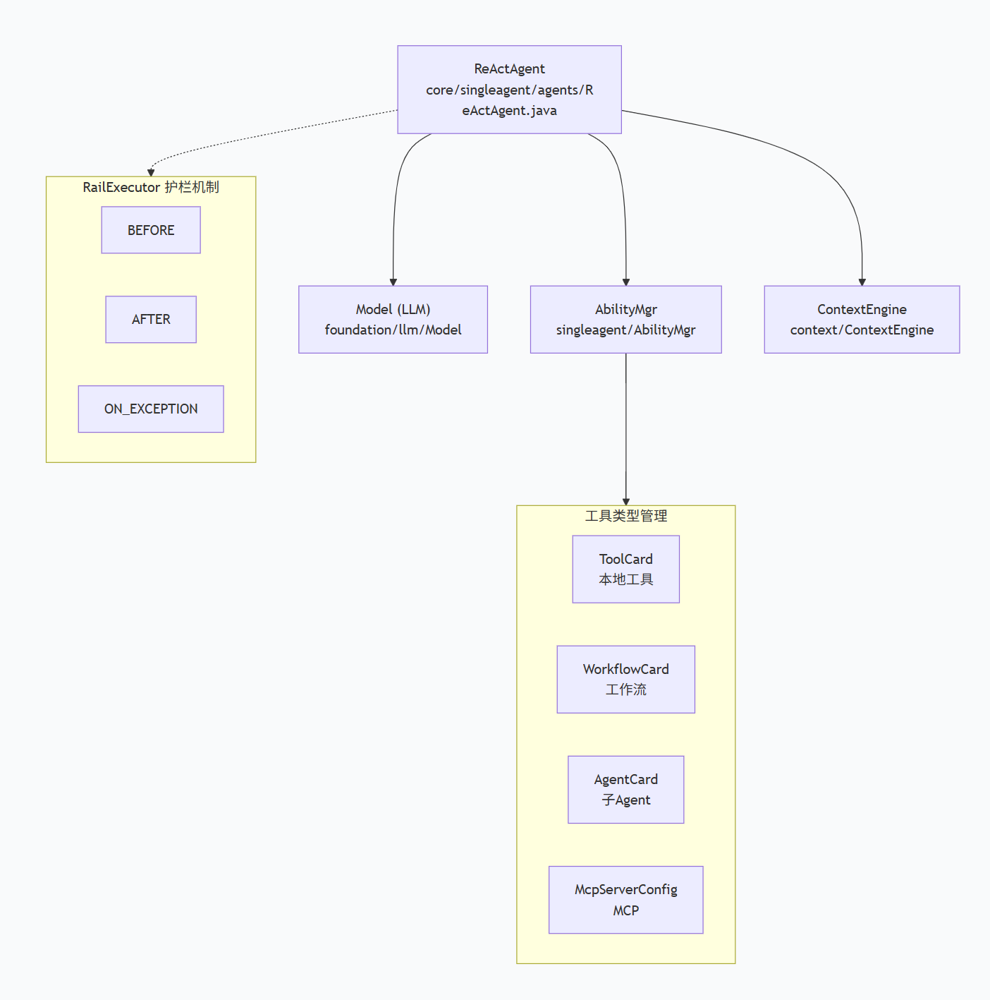
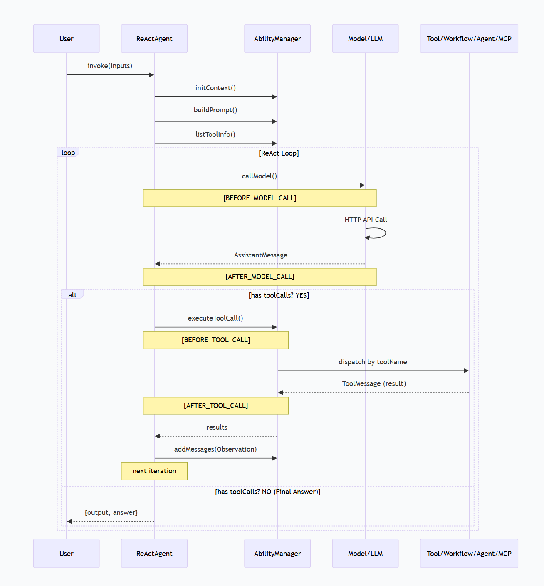

# OpenJiuWen Agent-Core ReAct Agent 工具/API 调用机制源码分析

> 基于 agent-core-java 分支 0.1.12 源码，分析 ReAct Agent 如何调用 LLM API 与外部工具。

---

## 1. 整体架构概览

ReAct Agent 基于 **Reasoning → Acting → Observation** 循环范式实现。核心类关系如下：



**核心组件职责**：

| 组件 | 职责 |
|------|------|
| `ReActAgent` | ReAct范式主循环，协调LLM调用与工具执行 |
| `Model` | 统一LLM调用入口，通过SPI工厂创建具体Client |
| `AbilityManager` | 工具注册/发现/执行分派 |
| `ContextEngine` | 上下文管理、压缩、token窗口控制 |
| `RailExecutor` | 生命周期护栏，支持拦截/修改/重试 |
| `Runner` | 全局单例运行器，管理资源与执行 |

---

## 2. ReAct 主循环详解

### 2.1 入口方法 invoke()

`ReActAgent.invoke()` (ReActAgent.java:573) 是同步调用的入口：

```java
public Object invoke(Object inputs, Session session) {
    // 1. 解析输入 (支持Map和String两种格式)
    String query = extractUserText(queryPayload);

    // 2. 初始化回调上下文
    AgentCallbackContext ctx = AgentCallbackContext.builder()
        .agent(this).inputs(invokeInputs).session(session).build();

    // 3. 触发 BEFORE_INVOKE 事件
    fireCallbackEvent(BEFORE_INVOKE, ctx);

    // 4. 初始化模型上下文
    ModelContext context = initContext(session);

    // 5. 构建系统提示
    List&lt;BaseMessage&gt; systemMessages = [new SystemMessage(systemPrompt)];

    // 6. 获取可用工具列表
    List&lt;ToolInfo&gt; tools = getAbilityManager().listToolInfo();

    // 7. ReAct循环
    for (int iteration = 0; iteration &lt; maxIterations; iteration++) {
        // Step 1: Reasoning - 调用LLM
        AssistantMessage aiMessage = callModel(ctx, context, systemMessages, tools);

        // Step 2: 将LLM回复加入上下文
        context.addMessages(AssistantMessage with content + toolCalls);

        if (aiMessage.hasToolCalls()) {
            // Step 3: Acting - 执行工具
            List&lt;ToolExecutionEntry&gt; results = executeToolCallEntries(
                ctx, aiMessage.getToolCalls(), session, context);
            // Step 4: Observation - 工具结果(toolMessage)已注入context
        } else {
            // 无ToolCall → 最终回答
            return {"output": aiMessage.getContent(), "result_type": "answer"};
        }
    }
}
```

### 2.2 LLM调用阶段 (Reasoning)

`callModel()` 方法 (ReActAgent.java:291) 负责构建上下文窗口并调用LLM：

```java
private AssistantMessage callModel(AgentCallbackContext ctx,
        ModelContext context, List&lt;BaseMessage&gt; systemMessages, List&lt;ToolInfo&gt; tools) {
    // 1. 通过ContextEngine构建上下文窗口(含压缩/裁剪)
    var contextWindow = context.getContextWindow(systemMessages, tools, ...);

    // 2. 设置回调上下文的输入
    ctx.setInputs(ModelCallInputs.builder()
        .messages(contextWindow.getMessages())
        .tools(contextWindow.getToolList())
        .build());

    // 3. 通过RailExecutor执行带护栏的模型调用
    return railedModelCall(ctx).orElse(null);
}
```

**railedModelCall()** (ReActAgent.java:350) 通过 `RailExecutor` 包裹生命周期事件：

```java
private Optional&lt;AssistantMessage&gt; railedModelCall(AgentCallbackContext ctx) {
    return RailExecutor.execute(ctx,
        BEFORE_MODEL_CALL, AFTER_MODEL_CALL, ON_MODEL_EXCEPTION,
        () -&gt; {
            Model model = getLlm();
            ModelCallInputs inputs = (ModelCallInputs) ctx.getInputs();
            // 核心: 调用LLM API
            return model.invoke(
                inputs.getMessages(),  // 消息列表
                inputs.getTools(),     // 工具定义列表
                null, null,
                config.getModelName(), // 模型名称
                null, null, null, null, null
            );
        }
    );
}
```

### 2.3 LLM API调用链路

```
ReActAgent.callModel()
  → ReActAgent.railedModelCall()
    → Model.invoke(messages, tools, ..., modelName, ...)
      → BaseModelClient.invoke(messages, tools, ..., modelName, ...)
        → 构建HTTP请求 → 发送到LLM Provider API → 解析响应
```

**Model类** (foundation/llm/Model.java:42) 是统一的LLM调用入口：
- 基于 `ModelClientConfig.clientProvider` (如 "OpenAI", "DashScope") 通过 SPI/工厂模式创建对应的 `BaseModelClient`
- 委托 `BaseModelClient` 执行实际的HTTP API调用
- 同时支持 `invoke()`(同步) 和 `stream()`(流式) 两种模式

**BaseModelClient** (foundation/llm/model_clients/BaseModelClient.java:46) 是抽象基类：
- 管理 `api_key`, `api_base`, `timeout` 等连接配置
- 子类实现具体的HTTP请求构建和响应解析逻辑
- 使用 JDK `HttpClient` 发送请求

---

## 3. 工具调用机制详解 (Acting)

### 3.1 工具发现与注册

`AbilityManager` (core/singleagent/AbilityManager.java:52) 管理四种类型的能力：

| 能力类型 | 存储结构 | 执行方式 |
|---------|---------|---------|
| **ToolCard** (本地工具) | `Map&lt;String, ToolCard&gt;` | `Tool.invoke(args, kwargs)` |
| **WorkflowCard** (工作流) | `Map&lt;String, WorkflowCard&gt;` | `Runner.runWorkflow()` |
| **AgentCard** (子Agent) | `Map&lt;String, AgentCard&gt;` | `Runner.runAgent()` |
| **McpServerConfig** (MCP工具) | `Map&lt;String, McpServerConfig&gt;` | `McpClient.callTool()` |

**工具注册流程**：

```java
// 方式1: 通过AbilityManager直接添加
agent.getAbilityManager().add(toolCard);

// 方式2: 通过ResourceManager全局注册
Runner.resourceMgr().addTool(tool, agentTag);
```

**工具信息转换为LLM可理解的格式**：

```java
// AbilityManager.listToolInfo() → 转换为ToolInfo列表
public List&lt;ToolInfo&gt; listToolInfo() {
    // 遍历 tools       → toolCard.toolInfo()
    // 遍历 workflows   → wfCard.toolInfo()
    // 遍历 agents      → agentCard.toolInfo()
    // 遍历 mcpServers  → 通过Runner.resourceMgr().getMcpTool()获取并缓存
}
```

每个 `ToolCard.toolInfo()` 生成一个 `ToolInfo` 对象，包含工具的 `name`、`description`、`parameters`(JSON Schema)，这些信息会作为 `tools` 参数传给LLM，LLM据此决定是否调用工具以及如何传参。

### 3.2 工具调用执行流程

LLM返回包含 `ToolCall` 的 `AssistantMessage` 后，进入工具执行阶段：

```
ReActAgent.executeToolCallEntries()                   (ReActAgent.java:456)
  → AbilityManager.execute(ctx, toolCalls, session, tag)   (AbilityManager.java:267)
    → 逐个ToolCall执行:
      → AbilityManager.railedExecuteSingleToolCall()       (AbilityManager.java:357)
        → RailExecutor.execute(BEFORE/AFTER/ON_TOOL_CALL, ...)
          → AbilityManager.executeSingleToolCall()          (AbilityManager.java:407)
            → 根据toolName分派到不同执行器
```

### 3.3 工具分派逻辑

`AbilityManager.executeSingleToolCall()` (AbilityManager.java:407) 核心分派逻辑：

```java
public ToolExecutionEntry executeSingleToolCall(ToolCall toolCall, Session session, String tag) {
    String toolName = toolCall.getName();
    Map&lt;String, Object&gt; toolArgs = parseToolArgs(toolCall.getArguments());

    if (tools.containsKey(toolName)) {
        // ===== 本地工具 =====
        ToolCard toolCard = tools.get(toolName);
        Tool tool = getToolFromResourceMgr(toolCard.getId(), tag);
        result = invokeTool(tool, toolArgs, session);

    } else if (workflows.containsKey(toolName)) {
        // ===== 工作流 =====
        WorkflowCard wfCard = workflows.get(toolName);
        result = Runner.runWorkflow(wfCard.getId(), toolArgs, session, null);

    } else if (agents.containsKey(toolName)) {
        // ===== 子Agent =====
        AgentCard agentCard = agents.get(toolName);
        Object agentInstance = Runner.resourceMgr().getAgent(agentCard.getId());
        AgentSessionApi childSession = AgentSessionApi.create(childSessionId, null, agentCard);
        result = Runner.runAgent(agentInstance, toolArgs, childSession, null);

    } else if (!mcpServers.isEmpty()) {
        // ===== MCP工具 =====
        Tool tool = resolveMcpToolByName(toolName);
        if (tool != null) {
            result = invokeTool(tool, toolArgs, session);
        }
    } else {
        // ===== 回退到ResourceManager全局查找 =====
        Tool tool = getToolFromResourceMgr(toolName, tag);
        result = invokeTool(tool, toolArgs, session);
    }

    // 构建ToolMessage(包含tool_call_id用于关联)
    ToolMessage toolMessage = ToolMessage.builder()
        .content(String.valueOf(result))
        .toolCallId(toolCall.getId())
        .build();
    return new ToolExecutionEntry(result, toolMessage);
}
```

分派优先级：

1. **本地工具** (`tools` Map) → 从 `ResourceManager` 获取 Tool 实例并调用
2. **工作流** (`workflows` Map) → 通过 `Runner.runWorkflow()` 执行
3. **子Agent** (`agents` Map) → 创建子Session，通过 `Runner.runAgent()` 执行
4. **MCP工具** (`mcpServers` Map) → 通过 `resolveMcpToolByName()` 查找并调用
5. **全局回退** → 从 `ResourceManager` 按名称查找

---

## 4. 四种工具类型详解

### 4.1 本地工具 (Tool + LocalFunction)

**基类** `Tool` (foundation/tool/Tool.java) — 抽象工具基类，定义 `invoke()` 和 `stream()` 接口。

**本地函数工具** `LocalFunction` (foundation/tool/function/LocalFunction.java:38)：

```java
// 创建方式1: 直接传入Function
ToolCard card = ToolCard.builder().name("add").description("Add two numbers").build();
LocalFunction tool = new LocalFunction(card, inputs -&gt; {
    int a = (int) inputs.get("a");
    int b = (int) inputs.get("b");
    return a + b;
});

// 创建方式2: ContextFunction(可访问session等kwargs)
LocalFunction tool = new LocalFunction(card, (inputs, kwargs) -&gt; {
    Session session = (Session) kwargs.get("session");
    return result;
});
```

**注解工具工厂** `AnnotatedToolFactory` (foundation/tool/function/AnnotatedToolFactory.java)：

通过 `@ToolDefinition` 注解自动将Java方法转为工具：

```java
@ToolDefinition(name = "search", description = "搜索信息", autoExtract = true)
public String search(@Param("query") String query) {
    return "搜索结果: " + query;
}

// 自动扫描并注册
List&lt;LocalFunction&gt; tools = AnnotatedToolFactory.scan(myService);
tools.forEach(t -&gt; agent.getAbilityManager().add(t.getCard()));
```

**执行流程**：

```
LocalFunction.invoke(inputs, kwargs)
  → validateInputs() — 根据ToolCard.inputParams(JSON Schema)校验并格式化输入
  → invokeFunction()
    → 如果是ContextFunction: contextFunc.apply(inputs, kwargs)
    → 如果是普通Function:   func.apply(inputs)
```

### 4.2 RESTful API工具

**类** `RestfulApi` (foundation/tool/service_api/RestfulApi.java:40)

将外部REST API封装为LLM可调用的工具：

```java
RestfulApiCard card = RestfulApiCard.builder()
    .name("get_weather")
    .url("https://api.weather.com/v1/forecast")
    .method("GET")
    .timeout(30.0)
    .inputParams({...})    // JSON Schema 输入定义
    .queries({...})        // URL查询参数映射
    .headers({...})        // 请求头映射
    .paths({...})          // 路径参数映射
    .build();

RestfulApi tool = new RestfulApi(card);
```

**执行流程**：

```
RestfulApi.invoke(inputs, kwargs)
  → SchemaUtils.formatWithSchema()       // 输入参数校验与格式化
  → ApiParamMapper.map()                  // 参数映射到PATH/QUERY/HEADER/BODY
  → resolveUrl()                          // 填充路径参数，拼接查询参数
  → buildHttpRequest()                    // 构建HTTP请求(GET/POST/PUT/PATCH/DELETE等)
  → buildHttpClient()                     // 配置HttpClient(代理/SSL/超时)
  → HttpClient.send()                     // 发送HTTP请求
  → validateResponse()                    // 校验响应(大小限制/状态码)
  → ParserRegistry.parse()                // 解析响应(JSON/Text/压缩格式)
  → 返回 {code, data, url, headers, message}
```

关键特性：
- 支持 `GET/POST/PUT/PATCH/DELETE/HEAD/OPTIONS` 方法
- `ApiParamMapper` 将LLM输出的参数自动映射到 PATH/QUERY/HEADER/BODY 四个位置
- `ParserRegistry` 支持JSON/Text响应解析，以及Gzip/Deflate解压
- 自动处理 SSL证书验证/代理配置/超时控制/响应大小限制

### 4.3 Workflow调用

当LLM选择调用Workflow时：

```java
result = Runner.runWorkflow(workflowId, toolArgs, adaptSubtaskSession(session), null);
```

`Runner` (core/runner/Runner.java) 是全局单例，代理所有调用到 `GLOBAL_RUNNER (RunnerImpl)`：
- `runWorkflow()` — 同步执行工作流
- `runWorkflowStreaming()` — 流式执行工作流

Workflow的执行会将Agent的Session适配为子任务Session，保持会话上下文的关联。

### 4.4 子Agent调用

当LLM选择调用子Agent时：

```java
String childSessionId = session.getSessionId() + ":" + toolCall.getId();
AgentSessionApi childSession = AgentSessionApi.create(childSessionId, null, agentCard);
result = Runner.runAgent(agentInstance, toolArgs, childSession, null);
```

子Agent拥有独立的Session（ID格式: `父Session:toolCallId`），通过 `Runner.runAgent()` 执行，支持递归的Agent嵌套调用。

### 4.5 MCP工具调用

**类** `McpTool` (foundation/tool/mcp/McpTool.java:20)

MCP (Model Context Protocol) 工具通过 `McpClient` 与外部MCP Server通信：

```java
// McpTool.invoke()
public Object invoke(Map&lt;String, Object&gt; inputs, Map&lt;String, Object&gt; kwargs) {
    Map&lt;String, Object&gt; arguments = inputs != null ? inputs : Map.of();
    arguments = SchemaUtils.formatWithSchema(arguments, card.getInputParams());
    Object result = mcpClient.callTool(card.getName(), arguments);
    return Map.of("result", result);
}
```

MCP客户端类型（均继承 `McpClient`）：

| 客户端 | 传输方式 | 适用场景 |
|-------|---------|---------|
| `SseClient` | Server-Sent Events | 长连接实时通信 |
| `StdioClient` | 标准输入输出 | 本地进程通信 |
| `StreamableHttpClient` | 可流式HTTP | HTTP流式调用 |
| `OpenApiClient` | OpenAPI规范 | REST接口集成 |
| `PlaywrightClient` | Playwright | 浏览器自动化 |

MCP工具的发现流程：
1. `AbilityManager` 注册 `McpServerConfig`
2. `listToolInfo()` 时通过 `Runner.resourceMgr().getMcpTool()` 获取MCP Server的工具列表
3. 工具信息缓存到本地 `tools` Map中，后续直接按名称匹配执行

---

## 5. Rail护栏机制

`RailExecutor` (core/singleagent/rail/RailExecutor.java:27) 是整个Agent的生命周期管理核心，实现了类似Python `@rail` 装饰器的机制。

### 5.1 生命周期事件

| 事件 | 触发时机 | 用途 |
|-----|---------|------|
| `BEFORE_INVOKE` | Agent invoke开始前 | 预处理、拦截 |
| `AFTER_INVOKE` | Agent invoke结束后 | 后处理、清理 |
| `BEFORE_MODEL_CALL` | LLM调用前 | 修改prompt、注入上下文、强制结束 |
| `AFTER_MODEL_CALL` | LLM调用后 | 响应检查、日志 |
| `ON_MODEL_EXCEPTION` | LLM调用异常 | 错误处理、重试 |
| `BEFORE_TOOL_CALL` | 工具调用前 | 参数修改、跳过工具、强制结束 |
| `AFTER_TOOL_CALL` | 工具调用后 | 结果修改、日志 |
| `ON_TOOL_EXCEPTION` | 工具调用异常 | 错误处理、重试 |

### 5.2 RailExecutor执行模型

```java
public static &lt;T&gt; Optional&lt;T&gt; execute(
    AgentCallbackContext ctx,
    AgentCallbackEvent before, after, onException,
    RailBody&lt;T&gt; body
) {
    int attempt = 0;
    while (true) {
        try {
            ctx.fire(before);                    // 触发前置事件
            if (ctx.hasForceFinishRequest()) {    // 支持强制结束
                return Optional.empty();
            }
            return Optional.ofNullable(body.execute());  // 执行业务逻辑
        } catch (Exception e) {
            ctx.fire(onException);                // 触发异常事件
            if (ctx.consumeRetryRequest()) {      // 支持重试
                attempt++;
                continue;
            }
            throw e;
        } finally {
            ctx.fire(after);                      // 触发后置事件(总是执行)
        }
    }
}
```

**关键能力**：

| 能力 | 说明 |
|------|------|
| **ForceFinish** | Rail可以在 `BEFORE_*` 事件中设置强制结束，跳过后续执行 |
| **Skip Tool** | Rail可以在 `BEFORE_TOOL_CALL` 中设置 `_skip_tool=true`，跳过工具执行 |
| **Modify Inputs** | Rail可以在 `BEFORE_TOOL_CALL` 中修改 `toolName` 和 `toolArgs` |
| **Retry** | Rail可以在 `ON_*_EXCEPTION` 中请求重试(支持延迟) |
| **Steering** | 通过 `SteeringQueue` 在循环中注入引导信息 |

---

## 6. 上下文管理

### 6.1 ContextEngine与ModelContext

`ContextEngine` 负责创建和管理 `ModelContext`，后者维护完整的对话历史：

```java
ModelContext context = contextEngine.createContext(null, session);
context.addMessages(new UserMessage(query));      // 添加用户消息
context.addMessages(assistantMessage);             // 添加LLM回复
context.addMessages(toolMessage);                  // 添加工具结果
```

`context.getContextWindow()` 方法负责：
- 拼接 system messages + 对话历史 + 工具定义
- 在超出token限制时进行压缩/裁剪(通过 `RoundLevelCompressor` 等处理器)

### 6.2 工具结果注入

工具执行后，结果自动以 `ToolMessage` 形式注入上下文：

```java
for (ToolExecutionEntry entry : results) {
    if (entry.toolMessage() != null) {
        context.addMessages(entry.toolMessage());
    }
}
```

`ToolMessage` 包含 `content`(工具返回内容) 和 `toolCallId`(关联到对应的ToolCall)，确保LLM能正确理解工具执行结果。

---

## 7. 流式输出

`ReActAgent.stream()` (ReActAgent.java:788) 支持流式输出：

```
ReActAgent.stream()
  → 创建AgentSessionApi
  → 启动独立线程执行 invokeForStream()
    → 与invoke()类似的ReAct循环
    → 但LLM调用使用 railedModelStreamCall()
      → Model.stream() → Iterator&lt;AssistantMessageChunk&gt;
      → 逐chunk合并(AssistantMessageChunk.merge)
      → 逐chunk写入AgentSessionApi (writeAssistantStreamChunk)
  → 返回 AgentSessionApi.streamIterator() 供消费端读取
```

流式调用关键代码 (ReActAgent.java:378)：

```java
private Optional&lt;AssistantMessage&gt; railedModelStreamCall(AgentCallbackContext ctx, AgentSessionApi agentSession) {
    return RailExecutor.execute(ctx,
        BEFORE_MODEL_CALL, AFTER_MODEL_CALL, ON_MODEL_EXCEPTION,
        () -&gt; {
            Model model = getLlm();
            ModelCallInputs inputs = (ModelCallInputs) ctx.getInputs();
            Iterator&lt;AssistantMessageChunk&gt; stream = model.stream(
                inputs.getMessages(), inputs.getTools(), ...);
            AssistantMessageChunk merged = null;
            while (stream != null && stream.hasNext()) {
                AssistantMessageChunk chunk = stream.next();
                merged = merged == null ? chunk : merged.merge(chunk);
                writeAssistantStreamChunk(agentSession, chunk, chunkIndex++);
            }
            // 将合并后的结果转为AssistantMessage
            return AssistantMessage.builder()
                .content(merged.getContent())
                .toolCalls(merged.getToolCalls())
                .build();
        }
    );
}
```

---

## 8. 工具中断与恢复机制

ReActAgent支持工具执行中断(如需要用户确认)：

```
工具执行 → 抛出ToolInterruptException
  → AbilityManager捕获并记录为ToolInterruptEntry
  → ReActAgent.collectToolInterrupts() 收集为ToolInterruptionState
  → 保存到Session状态中
  → 返回 {"result_type": "interrupt", "state": [...], "interrupt_ids": [...]}

恢复时:
  → 加载ToolInterruptionState
  → 将InteractiveInput作为恢复参数(用户确认/输入)
  → 重新执行被中断的ToolCall
  → 继续ReAct循环
```

关键数据结构：

```java
// 中断状态
ToolInterruptionState {
    int iteration;                    // 中断时的循环迭代数
    List&lt;ToolInterruptEntry&gt; interruptedTools;  // 被中断的工具列表
    String originalQuery;             // 原始用户查询
}

// 中断条目
ToolInterruptEntry {
    ToolCall toolCall;               // 被中断的工具调用
    InterruptRequest request;        // 中断请求(包含中断ID等)
}
```

---

## 9. 完整调用时序图



---

## 10. 关键源码文件索引

| 文件 | 路径 | 职责 |
|-----|------|------|
| ReActAgent | `core/singleagent/agents/ReActAgent.java` | ReAct范式主循环 |
| ReActAgentConfig | `core/singleagent/agents/ReActAgentConfig.java` | Agent配置 |
| BaseAgent | `core/singleagent/BaseAgent.java` | Agent抽象基类 |
| AbilityManager | `core/singleagent/AbilityManager.java` | 工具注册/发现/执行 |
| Tool | `foundation/tool/Tool.java` | 工具抽象基类 |
| ToolCard | `foundation/tool/ToolCard.java` | 工具元数据卡片 |
| ToolInfo | `foundation/tool/schema/ToolInfo.java` | 工具描述信息(LLM可见) |
| LocalFunction | `foundation/tool/function/LocalFunction.java` | 本地函数工具 |
| AnnotatedToolFactory | `foundation/tool/function/AnnotatedToolFactory.java` | 注解工具工厂 |
| RestfulApi | `foundation/tool/service_api/RestfulApi.java` | REST API工具 |
| RestfulApiCard | `foundation/tool/service_api/RestfulApiCard.java` | REST API工具配置 |
| McpTool | `foundation/tool/mcp/McpTool.java` | MCP协议工具 |
| McpClient | `foundation/tool/mcp/McpClient.java` | MCP客户端基类 |
| Model | `foundation/llm/Model.java` | LLM统一调用入口 |
| BaseModelClient | `foundation/llm/model_clients/BaseModelClient.java` | LLM客户端基类 |
| ToolCall | `foundation/llm/schema/ToolCall.java` | LLM工具调用数据结构 |
| ToolMessage | `foundation/llm/schema/ToolMessage.java` | 工具执行结果消息 |
| RailExecutor | `core/singleagent/rail/RailExecutor.java` | Rail护栏执行器 |
| AgentCallbackContext | `core/singleagent/rail/AgentCallbackContext.java` | 回调上下文 |
| Runner | `core/runner/Runner.java` | 全局运行器单例 |
| ContextEngine | `core/context/ContextEngine.java` | 上下文引擎 |

---

## 11. 总结

openjiuwen agent-core 的 ReAct Agent 工具调用机制具有以下核心特点：

1. **标准ReAct循环**：Reasoning(调LLM) → Acting(执行工具) → Observation(注入结果) 循环直到获得最终回答
2. **四种工具类型**：本地Tool、Workflow、子Agent、MCP工具，统一通过ToolInfo暴露给LLM
3. **灵活的LLM接入**：通过SPI+工厂模式支持多种LLM Provider(OpenAI/DashScope等)
4. **全链路Rail护栏**：从invoke到model_call再到tool_call，每个环节都有before/after/exception钩子，支持拦截、修改、重试、强制结束
5. **REST API工具**：内置RestfulApi工具类，自动处理参数映射(PATH/QUERY/HEADER/BODY)、SSL、压缩、代理等
6. **MCP协议支持**：通过McpClient与外部MCP Server通信，支持SSE/Stdio/HTTP等多种传输方式
7. **流式输出**：支持流式LLM调用和流式结果输出，通过独立线程+Iterator实现
8. **工具中断恢复**：支持工具执行中断(如需用户确认)和后续恢复，状态持久化到Session
9. **上下文压缩**：ContextEngine在超出token窗口时自动压缩历史对话，确保LLM调用不超限
