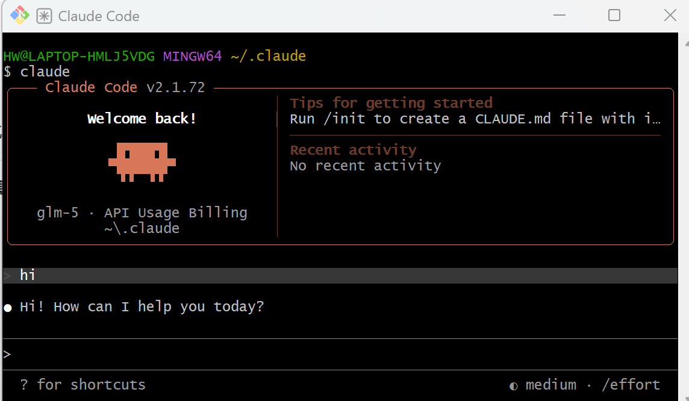
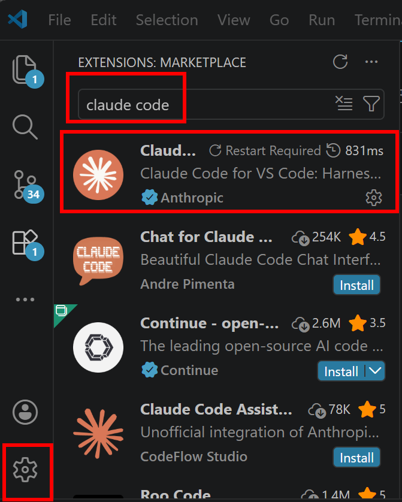
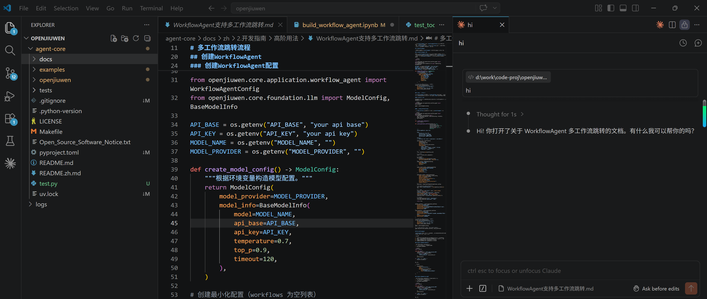

## 前置安装依赖
- git安装：https://git-scm.com/install/windows 安装时勾选Add Git to PATH
- 安装后验证：git --version

- node.js安装：https://nodejs.org/zh-cn/download， 推荐安装v22.22.1 LTS版本
- 配置国内镜像：npm config set registry https://registry.npmmirror.com

- 安装后验证：node -v   npm -v
python安装：https://www.python.org/downloads/windows/， 推荐安装3.13版本，安装时勾选Add Python to PATH
- 安装后验证：python --version    pip --version


## claude安装
1. 在window的命令行中运行：
- npm install -g @anthropic-ai/claude-code

2. claude配置
2.1 将C:\Users\xxx(用户名)\.claude\.claude.json配置为下面内容：
```json
{
  "hasCompletedOnboarding": true
}
```

2.2 配置模型
将C:\Users\xxx(用户名)\.claude\settings.json配置为下面内容：
```json
{
  "env": {
    "ANTHROPIC_AUTH_TOKEN": "sk-sp-xxxxxxxxxxx",
    "ANTHROPIC_BASE_URL": "https://coding.dashscope.aliyuncs.com/apps/anthropic",
    "ANTHROPIC_MODEL": "glm-5"
  }
}
```

3. 启动claude
进入项目目录，在终端执行claude命令。


## VS code安装
- 下载安装包：https://code.visualstudio.com/
- 运行并安装，建议点击“浏览”将安装路径修改为 D:\DevTools\VSCode 等非系统盘，避免占用C盘空间

## VS code 配置 claude code插件
- 在VS code左下角设置选Extensions,搜索claude code,点击install

- 重启VS code,打开Claude code
  